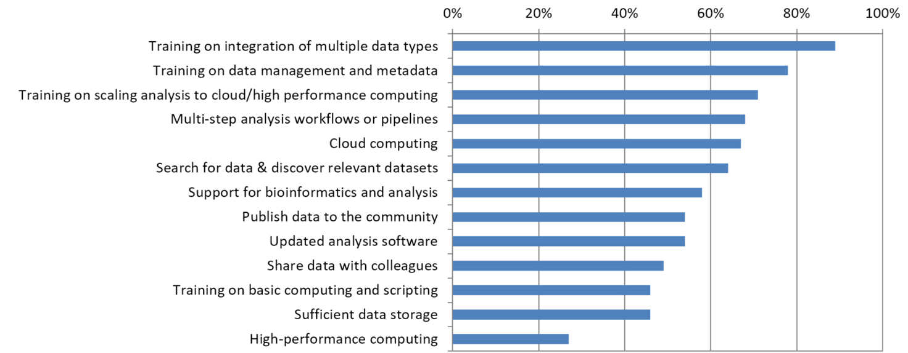

# Graduate Seminar ABE 598 “Data Lifecycle” 

## Objective 

The objective of this course will be to introduce students to the data lifecycle and skills necessary to make use of data from heterogeneous sources as a first step toward synthetic analysis. Students will learn how to curate data, collect their own data, and make use of existing repositories. They will also be introduced to the landscape of available data and repositories. Finally, they will learn the fundamentals of exploratory data analysis and reproducible research.

## Topics

* What data are already available?
* Data shapes and structures (tables, relational & nosql databases, raster)
* Quality assurance and Data cleaning
* Data description
* Metadata and Data standards
* Publishing data: repositories and versions
* Exploratory data analysis
* Reproducible Research

## Time

One hour per week of lecture

The course could be extended in two ways:
 * one hour / week of lab so that students can learn hands on 
 * group projects that allow students to explore problems related to their own field of interest through the lens of curating a dataset. Prior to beginning the course, students will identify a small dataset that they will curate over the course of the semester.

## Rationale: 

[Barone et al 2017 bioRxiv](http://biorxiv.org/content/early/2017/02/14/108555)

## References

* Unmet Needs for Analyzing Biological Big Data: A Survey of 704 NSF Principal Investigators 
[Barone et al 2017 bioRxiv](http://biorxiv.org/content/early/2017/02/14/108555)
* DataONE Education Module: Metadata. DataONE. www.dataone.org/sites/all/documents/L07_Metadata.pptx 
* HDF Group Big HDF FAQs: Everything that HDF Users have Always Wanted to Know about Hadoop. . . But Were Ashamed to Ask. support.hdfgroup.org/pubs/papers/Big_HDF_FAQs.pdf
* LeBauer et al (2017). TERRA REF Documentation: First Draft - alpha release. Zenodo. http://doi.org/10.5281/zenodo.375663
* Bizer, Christian, Tom Heath, and Tim Berners-Lee. "Linked data-the story so far." Semantic services, interoperability and web applications: emerging concepts (2009): 205-227.
* LeBauer, David, et al. “BETYdb: a yield, trait, and ecosystem service database applied to second‐generation bioenergy feedstock production." GCB Bioenergy (2017). http://onlinelibrary.wiley.com/doi/10.1111/gcbb.12420/full
* Pérez-Harguindeguy et al (2013) New handbook for standardised measurement of plant functional traits worldwide. Australian Journal of Botany 61 , 167–234. http://dx.doi.org/10.1071/BT12225
